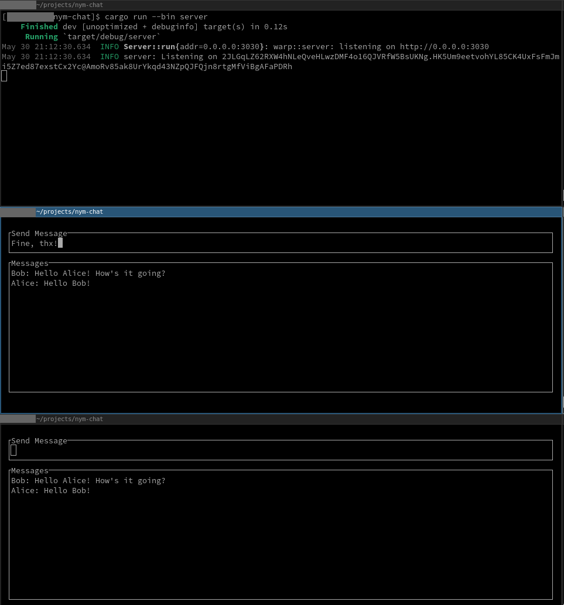

# Nym chat example

This repository contains a hacky proof of concept for a Nym chat service that's actually somewhat private. Currently Nym
mostly provides great sender anonymity, which makes building bidirectional applications hard. There are ideas how to
work around this using SURBs (single use reply blocks) but these still need some research.

To still be able to build a bidirectional service we instead use broadcasting as our recipient anonymity primitive. This
works by encrypting messages to their respective recipients, but sending them to everyone in the anonymity set. This is
similar to the approach taken by Bitmessage. It's easy to see that if everyone receives the same messages but can only
decrypt some of them (and the encryption scheme doesn't allow identification of communicating parties), that an outside
observer or even the server itself won't learn anything about communication relationships from observing the messages
and message queries. But at the same time this approach doesn't really scale.

## How to run it

You can test it by cloning this repo and running (assuming rust is installed) the following commands. Note that
websocket addresses have to be supplied in the following format: `ws://127.0.0.1:1234`. We also assume all three
processes are running locally.

* Three instances of Nym native clients
* The server: `cargo run --bin server -- --websocket <websocket-nym-client-1>`
* Client 1: `cargo run --bin client -- --service-provider <server-nym-address> --websocket <websocket-nym-client-2> http://127.0.0.1:3030 0123456789012345678901234567890101234567890123456789012345678901 Alice`
* Client 2: `cargo run --bin client -- --service-provider <server-nym-address> --websocket <websocket-nym-client-3> http://127.0.0.1:3030 0123456789012345678901234567890101234567890123456789012345678901 Bob`

This is only an example for educational purposes only, please understand and fix the existing issues if you want to
use it for anything else.
`
## Screenshot
